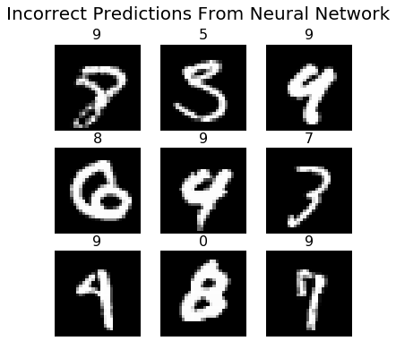

# Studying the MNIST dataset

## Introduction

The [MNIST dataset](http://yann.lecun.com/exdb/mnist/) contains 51,000 images of handwritten digits. These handwritten digits can be used to train various machine learning models to recognise digits. The MNIST dataset contains a further 10,000 digits that allow machine learning models to be tested.

In this notebook, two neural networks will be constructed with the aim of recognising handwritten digits such as the one shown below.

The first neural network that will be created will be a fully connected neural network with five hidden layers. It will be found that with this architecture, the network is able to predict the digits with 96% accuracy.

The second neural network that will be created will be a convolutional neural network (CNN). This model will have an alternating series of convolutional, max pooling and dropout layers. It will be seen that the CNN that is created in this notebook will have a 99% accuracy in predicting the digits in the test dataset.
 
## The First Model: Fully Connected

The first model is a fully connected neural network that achieves an accuracy of 96% with the following architecture:

* An initial *flat* layer of 784 neurons corresponding to each of the pixels in the 28x28 image.
* 5 hidden layers of 30 fully connected neurons each. These neurons will have a ReLU activation.
* A final layer of 10 neurons corresponding to the 10 digits. The neurons in this final layer will have a softmax activation. 

In addition:

The model will use:
* The adam optimizer
* Categorical cross entropy as a loss function to guide training
* Accuracy as a metric
* Be trained over 20 epochs

The model can be constucted and trained using Keras. Shown below are the accuracy and loss for both the training
and validation datasets.

As can be seen, the network begins to overfit to the training data around the 6th epoch. 

The model that is constucted has predicitive capabilities. Shown below are sample predictions that the network is able to
make. 

## The Second Model: CNN

The second model that will be built will be a convolutional neural network that achieves an accuracy of 99%. The network will have:
* An initial 20 convolutions of kernel size 5x5. 
* A 2x2 max pooling layer.
* A layer of 40 convolutions of kernel size 3x3.
* A 2x2 max pooling layer.
* A 0.2 dropout layer.
* A layer of 60 convolutions of kernel size 2x2.
* A 2x2 max pooling layer.
* A 0.2 dropout layer.

The result of this will be flattened and connected to:

* A dense layer of 100 neurons.
* A 0.2 dropout layer.
* A final dense layer of 10 neurons that corresponds to the 10 digits.

All neurons will have the ReLU activation, except for the last layer that will have a softmax activation. In addition, 
the model will use: 

* The adam optimizer
* Categorical cross entropy as a loss function to guide training
* Accuracy as a metric
* Be trained on 20 epochs

The model can be constucted and trained using Keras. Shown below are the accuracy and loss for both the training
and validation datasets.

The model achieves a 99% accuracy on the test dataset. Shown below are some of the digits it was unable to predict correctly. On top of each image is the incorrect prediction that the model gave.

